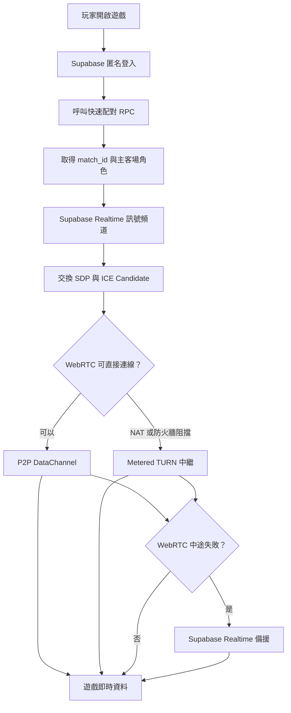

# 網頁遊戲多人連線標準建置手冊

> 適用架構：**Supabase 匿名登入＋快速配對＋Realtime 訊號交換＋WebRTC P2P＋Metered TURN＋Supabase Realtime 備援＋Playwright 雙玩家自動測試**

這份文件是可套用到下一款網頁遊戲的標準流程。基礎設施可以重複使用，但每款遊戲的角色、輸入、物理、碰撞、分數與狀態封包仍必須依遊戲規則調整。

---

## 1. 最終架構



### 連線分工

| 元件 | 用途 |
|---|---|
| Supabase Auth | 建立匿名玩家身分與 JWT |
| Supabase PostgreSQL | 配對佇列、比賽房間、比分紀錄 |
| Supabase Realtime | WebRTC SDP／ICE 訊號交換，以及最後備援 |
| WebRTC P2P | 玩家間直接傳送遊戲封包，通常延遲最低 |
| Metered TURN | P2P 被 NAT／防火牆阻擋時中繼 WebRTC 封包 |
| Edge Function | 安全地向已登入玩家提供短期 TURN 憑證 |
| Playwright | 同時建立兩個隔離玩家，執行自動配對與同步測試 |
| GitHub Actions | 每次更新自動驗證並產生報告 |

---

## 2. 哪些可以直接重用？

### 大多可直接複製

- Supabase 匿名登入流程
- 快速配對資料表與 RPC 架構
- Realtime 訊號頻道
- `turn-credentials` Edge Function
- Metered Secrets 設定
- WebRTC PeerConnection 建立流程
- Control／Game 雙 DataChannel 架構
- P2P → TURN → Realtime 備援狀態機
- WebRTC 路由與 RTT 診斷
- Playwright 雙玩家測試框架
- GitHub Actions 工作流程
- 延遲、抖動、丟包測試探針

### 每款遊戲一定要改

- 玩家輸入格式
- 角色與物件狀態
- 地圖座標轉換
- 物理與碰撞
- 主場／客場鏡像規則
- 勝負條件與分數
- 封包欄位
- 插值與預測方式
- 漂移量測對象
- Playwright 操作動作與斷言

> 空氣曲棍球使用「主場權威球體快照」。賽車、射擊、格鬥或回合制遊戲需要重新設計同步協定，不能只更換角色圖案。

---

## 3. 需要準備的服務

1. GitHub Repository
2. GitHub Pages 或其他 HTTPS 網站
3. Supabase Project
4. Metered TURN Application
5. Node.js 24
6. Playwright

WebRTC、Service Worker、部分瀏覽器 API 在正式環境通常需要 HTTPS。GitHub Pages 已提供 HTTPS。

---

## 4. 建議專案結構

```text
.
├── index.html
├── src/
│   ├── game/
│   │   ├── game-engine.js
│   │   ├── multiplayer-protocol.js
│   │   └── multiplayer-render.js
│   ├── cloud/
│   │   ├── cloud-config.js
│   │   ├── auth.js
│   │   ├── matchmaking.js
│   │   ├── signaling.js
│   │   ├── webrtc-transport.js
│   │   └── realtime-fallback.js
│   └── testing/
│       └── network-test-hooks.js
├── supabase/
│   ├── config.toml
│   ├── functions/
│   │   └── turn-credentials/
│   │       └── index.ts
│   └── sql/
│       └── multiplayer-matchmaking.sql
├── scripts/
│   ├── validate-multiplayer.mjs
│   └── run-sync-matrix.mjs
├── tests/e2e/
│   └── multiplayer.spec.mjs
├── playwright.config.mjs
├── package.json
└── .github/workflows/
    ├── validate-multiplayer.yml
    └── multiplayer-e2e-lab.yml
```

小型專案可以先放在根目錄；遊戲開始擴大後，再依上面的結構拆分。

---

# 第一階段：Supabase

## 5. 建立 Supabase Project

在 Supabase 建立新專案後，記錄：

```text
Project URL
Publishable / anon key
Project ref
```

前端只可使用 publishable／anon key。以下內容不能放到前端或 GitHub：

```text
service_role key
Supabase secret key
Metered API key
TURN 固定密碼
```

### 前端設定範本

```js
window.GAME_CLOUD_CONFIG = {
  enabled: true,
  supabaseUrl: 'https://YOUR_PROJECT_REF.supabase.co',
  supabasePublishableKey: 'YOUR_PUBLISHABLE_KEY',
};
```

---

## 6. 開啟匿名登入

進入 Supabase Dashboard：

```text
Authentication → Providers → Anonymous Sign-Ins → Enable
```

前端登入：

```js
async function ensureAnonymousUser(client, playerName) {
  const current = await client.auth.getSession();
  if (current.error) throw current.error;
  if (current.data?.session?.user) return current.data.session.user;

  const result = await client.auth.signInAnonymously({
    options: {
      data: { player_name: playerName },
    },
  });

  if (result.error) throw result.error;
  if (!result.data?.user) throw new Error('Anonymous sign-in failed');
  return result.data.user;
}
```

### 建議只建立一個 Supabase Client

```js
const client = window.supabase.createClient(
  window.GAME_CLOUD_CONFIG.supabaseUrl,
  window.GAME_CLOUD_CONFIG.supabasePublishableKey,
  {
    auth: {
      persistSession: true,
      autoRefreshToken: true,
      detectSessionInUrl: false,
      storageKey: 'your-game-auth-v1',
    },
    realtime: {
      params: { eventsPerSecond: 30 },
    },
  },
);

window.GameSupabaseClient = client;
```

不要讓登入、排行榜、多人引擎各自建立不同 Client，否則可能造成多份 Session、Socket 與重複訂閱。

---

## 7. 建立快速配對資料庫

目前泡泡島可參考：

```text
supabase/sql/multiplayer-matchmaking.sql
```

建議包含：

### `quick_match_queue`

```text
user_id
player_name
status
match_id
joined_at
heartbeat_at
```

### `quick_matches`

```text
id
host_user_id
guest_user_id
host_name
guest_name
status
host_score
guest_score
created_at
started_at
ended_at
```

### 建議 RPC

```text
join_quick_match(player_name)
cancel_quick_match()
quick_match_waiting_count()
start_quick_match(match_id)
finish_quick_match(match_id, scores...)
```

### 配對的重要原則

- RPC 使用 `security definer`
- 函式內先確認 `auth.uid()`
- 玩家名稱限制長度
- 使用 PostgreSQL advisory lock，避免兩名玩家同時搶同一位對手
- 清理超過 15～30 秒沒有 heartbeat 的等待紀錄
- 一名玩家同時只能存在一個有效房間
- RLS 只允許玩家讀取自己的房間與佇列紀錄
- 不讓前端直接任意新增或修改比賽資料表

新遊戲可沿用 SQL，但建議將資料表或函式加上遊戲名稱前綴，避免同一 Supabase Project 內多款遊戲互相干擾：

```text
racing_quick_matches
puzzle_quick_matches
battle_quick_matches
```

---

# 第二階段：Metered TURN

## 8. 建立 Metered Application

在 Metered 建立 TURN Server Application 與 API Credential。

記錄：

```text
Application name
API key
```

不要把 API Key 寫進 JavaScript、README、Issue 或 GitHub Actions 日誌。

---

## 9. 將 Metered 金鑰放進 Supabase Secrets

Supabase Dashboard：

```text
Edge Functions → Secrets
```

建立：

```text
METERED_APP_NAME
METERED_API_KEY
```

範例：

```text
METERED_APP_NAME = your-game
```

只填 Application name，不填 `https://` 或 `.metered.live`。

---

## 10. 建立 TURN Edge Function

路徑：

```text
supabase/functions/turn-credentials/index.ts
```

範本：

```ts
const corsHeaders = {
  'Access-Control-Allow-Origin': '*',
  'Access-Control-Allow-Headers': 'authorization, x-client-info, apikey, content-type',
  'Access-Control-Allow-Methods': 'POST, OPTIONS',
  'Content-Type': 'application/json; charset=utf-8',
};

const json = (body: unknown, status = 200) =>
  new Response(JSON.stringify(body), {
    status,
    headers: {
      ...corsHeaders,
      'Cache-Control': 'no-store, max-age=0',
    },
  });

Deno.serve(async (request) => {
  if (request.method === 'OPTIONS') {
    return new Response('ok', { headers: corsHeaders });
  }

  if (request.method !== 'POST') {
    return json({ error: 'method_not_allowed' }, 405);
  }

  const authorization = request.headers.get('Authorization') || '';
  if (!authorization.startsWith('Bearer ')) {
    return json({ error: 'authentication_required' }, 401);
  }

  const appName = Deno.env.get('METERED_APP_NAME')?.trim();
  const apiKey = Deno.env.get('METERED_API_KEY')?.trim();

  if (!appName || !apiKey) {
    return json({ error: 'turn_secrets_missing' }, 503);
  }

  const endpoint =
    `https://${encodeURIComponent(appName)}.metered.live/api/v1/turn/credentials` +
    `?apiKey=${encodeURIComponent(apiKey)}`;

  try {
    const response = await fetch(endpoint, {
      headers: { Accept: 'application/json' },
    });

    const data = await response.json().catch(() => null);
    if (!response.ok) {
      return json({
        error: 'turn_provider_error',
        providerStatus: response.status,
      }, 502);
    }

    const iceServers = Array.isArray(data)
      ? data
      : Array.isArray(data?.iceServers)
        ? data.iceServers
        : [];

    const hasTurn = iceServers.some((server: { urls?: string | string[] }) => {
      const urls = Array.isArray(server?.urls) ? server.urls : [server?.urls];
      return urls.some(
        (url) => typeof url === 'string' && /^turns?:/i.test(url),
      );
    });

    if (!hasTurn) {
      return json({ error: 'turn_servers_missing' }, 502);
    }

    const ttl = 3600;
    return json({
      iceServers,
      ttl,
      expiresAt: Date.now() + ttl * 1000,
      provider: 'metered-open-relay',
    });
  } catch (error) {
    return json({
      error: 'turn_request_failed',
      message: error instanceof Error ? error.message : String(error),
    }, 502);
  }
});
```

### `supabase/config.toml`

```toml
project_id = "YOUR_PROJECT_REF"

[functions.turn-credentials]
verify_jwt = true
```

目前流程要求玩家先匿名登入，再呼叫 Edge Function。不要為了處理 401 直接公開 TURN 端點；應先檢查 JWT 驗證方式是否需要升級。

### 部署

CLI：

```bash
supabase login
supabase link --project-ref YOUR_PROJECT_REF
supabase functions deploy turn-credentials
```

也可以在 Supabase Dashboard 直接建立與部署。

---

## 11. 前端取得 TURN ICE Servers

```js
let cachedIceServers = null;
let turnExpiresAt = 0;

function normalizeIceServers(servers) {
  const output = [];

  for (const server of servers || []) {
    const urls = Array.isArray(server?.urls)
      ? server.urls
      : [server?.urls || server?.url];

    for (const url of urls) {
      if (typeof url !== 'string' || !url) continue;
      output.push({
        urls: url,
        ...(server.username ? { username: server.username } : {}),
        ...(server.credential ? { credential: server.credential } : {}),
      });
    }
  }

  return output;
}

async function loadIceServers(client) {
  if (cachedIceServers && turnExpiresAt > Date.now() + 120_000) {
    return cachedIceServers;
  }

  const result = await client.functions.invoke('turn-credentials', {
    body: {},
  });

  if (result.error) throw result.error;

  const turnServers = normalizeIceServers(result.data?.iceServers);
  if (!turnServers.some((server) => /^turns?:/i.test(String(server.urls)))) {
    throw new Error('TURN servers missing');
  }

  cachedIceServers = [
    { urls: 'stun:stun.cloudflare.com:3478' },
    { urls: 'stun:stun.l.google.com:19302' },
    ...turnServers,
  ];

  turnExpiresAt = Number(result.data?.expiresAt) || Date.now() + 10 * 60_000;
  return cachedIceServers;
}
```

把 STUN 與 TURN 同時放進 `iceServers`，並使用：

```js
iceTransportPolicy: 'all'
```

瀏覽器會優先嘗試較直接的候選路徑，必要時改用 TURN。

測試 TURN 時才使用：

```js
iceTransportPolicy: 'relay'
```

正式版不建議永遠強制 TURN，否則所有遊戲流量都會消耗 TURN 額度並增加延遲。

---

# 第三階段：WebRTC

## 12. 建立 PeerConnection

```js
function createPeerConnection(iceServers, forceTurn = false) {
  return new RTCPeerConnection({
    iceServers,
    iceCandidatePoolSize: 4,
    bundlePolicy: 'max-bundle',
    iceTransportPolicy: forceTurn ? 'relay' : 'all',
  });
}
```

`iceCandidatePoolSize` 可設 2～8。太大會增加準備成本，不一定比較快。

---

## 13. 使用兩個 DataChannel

### Control Channel

用途：

- 開始遊戲
- ACK
- Ping／Pong
- 暫停
- 結束
- 離線通知
- 關鍵事件

```js
const controlChannel = peer.createDataChannel('game-control', {
  ordered: true,
});
```

Control 必須可靠且有順序。

### Game Channel

用途：

- 玩家位置
- 即時輸入
- 球體／角色快照
- 高頻非關鍵狀態

```js
const gameChannel = peer.createDataChannel('game-state', {
  ordered: false,
  maxRetransmits: 0,
});
```

Game Channel 不重傳過期位置。舊座標晚到通常比遺失更糟。

### 壅塞保護

```js
function sendLatest(channel, packet) {
  if (channel?.readyState !== 'open') return false;
  if (channel.bufferedAmount > 12_000) return false;

  try {
    channel.send(JSON.stringify(packet));
    return true;
  } catch {
    return false;
  }
}
```

不要無限制把位置封包堆進 DataChannel。

---

## 14. 使用 Realtime 交換 WebRTC 訊號

每場比賽建立獨立頻道：

```js
const signaling = client.channel(`game:${matchId}:signaling`, {
  config: {
    private: false,
    broadcast: { ack: false, self: false },
  },
});
```

建議事件：

```text
hello-v1
sdp-offer-v1
sdp-answer-v1
ice-v1
fallback-ready-v1
fallback-control-v1
fallback-game-v1
```

Payload 必須包含：

```text
from role
protocol version
sentAt
必要資料
```

範例：

```js
function sendSignal(event, payload) {
  return signaling.send({
    type: 'broadcast',
    event,
    payload: {
      protocol: 1,
      from: role,
      sentAt: Date.now(),
      ...payload,
    },
  });
}
```

不要在不同遊戲版本共用相同事件名稱卻更改封包格式。升級協定時使用 `v2`、`v3`。

---

## 15. Offer／Answer 流程

主場：

```text
建立 PeerConnection
建立兩個 DataChannel
createOffer()
setLocalDescription()
透過 Realtime 傳送 SDP Offer
```

客場：

```text
收到 Offer
建立 PeerConnection
setRemoteDescription()
createAnswer()
setLocalDescription()
透過 Realtime 傳送 SDP Answer
```

雙方：

```text
onicecandidate → Realtime 傳送 Candidate
收到 Candidate → addIceCandidate()
```

Remote Description 尚未完成前收到的 ICE Candidate，先放進陣列；設定完成後再依序加入。

---

## 16. 判斷 P2P 或 TURN

連線後使用 `getStats()`：

```js
async function inspectRoute(peer) {
  const stats = await peer.getStats();
  const reports = new Map();
  stats.forEach((report) => reports.set(report.id, report));

  let pair = null;

  stats.forEach((report) => {
    if (report.type === 'transport' && report.selectedCandidatePairId) {
      pair = reports.get(report.selectedCandidatePairId) || pair;
    }

    if (
      report.type === 'candidate-pair' &&
      report.state === 'succeeded' &&
      (report.selected || report.nominated)
    ) {
      pair = report;
    }
  });

  if (!pair) return { route: 'WEBRTC', rttMs: null };

  const local = reports.get(pair.localCandidateId);
  const remote = reports.get(pair.remoteCandidateId);
  const relayed =
    local?.candidateType === 'relay' || remote?.candidateType === 'relay';

  return {
    route: relayed ? 'METERED' : 'P2P',
    rttMs: Number.isFinite(pair.currentRoundTripTime)
      ? Math.round(pair.currentRoundTripTime * 1000)
      : null,
  };
}
```

HUD 建議顯示：

```text
P2P 32ms
METERED 58ms
RELAY 96ms
```

---

# 第四階段：Supabase Realtime 備援

## 17. 建立傳輸狀態機

```text
IDLE
  ↓
MATCHMAKING
  ↓
SIGNALING
  ↓
WEBRTC_CONNECTING
  ├─ 成功 → WEBRTC_ACTIVE（P2P 或 TURN）
  └─ 逾時 → REALTIME_FALLBACK

WEBRTC_ACTIVE
  ├─ 正常 → PLAYING
  └─ disconnected／failed → 等待短暫恢復
                         └─ 仍失敗 → REALTIME_FALLBACK
```

建議狀態：

```js
const Transport = Object.freeze({
  NONE: 'none',
  WEBRTC: 'webrtc',
  REALTIME: 'realtime',
});
```

### 建議逾時

| 項目 | 建議範圍 |
|---|---:|
| WebRTC 首次建立 | 5～12 秒 |
| disconnected 恢復等待 | 2～4 秒 |
| 遠端完全無封包 | 8～15 秒 |
| 配對 heartbeat | 每 4～8 秒 |
| 佇列失效 | 15～30 秒 |

---

## 18. Realtime 備援封包

當 WebRTC 不可用時，沿用同一 Realtime Channel：

```js
async function sendRealtimeFallback(event, packet) {
  return signaling.send({
    type: 'broadcast',
    event,
    payload: {
      from: role,
      protocol: 1,
      packet,
      sentAt: Date.now(),
    },
  });
}
```

### 原則

- Control 事件全部保留
- Game state 降低頻率
- 只保留最新狀態
- 封包帶 sequence 與 timestamp
- 收到舊 sequence 直接丟棄
- Realtime 備援不是高效能遊戲伺服器，只是讓比賽能繼續

建議 WebRTC 30～40Hz 時，Realtime 備援降到約 10～20Hz。

---

# 第五階段：遊戲狀態同步

## 19. 推薦「主場權威」模型

對兩人即時遊戲，零成本架構可讓其中一位玩家的瀏覽器當權威模擬端：

```text
主場：計算完整物理、碰撞、分數與勝負
客場：傳送輸入，顯示主場快照
```

### 主場負責

- 真實遊戲時間
- 物理世界
- 碰撞
- 隨機種子
- 分數
- 勝負
- 發送狀態快照

### 客場負責

- 本機輸入立即顯示
- 傳送輸入
- 接收權威快照
- 插值顯示
- 必要時小幅預測

這能降低雙方各自模擬後結果不同造成的漂移。

### 限制

主場權威不是防作弊伺服器。主場玩家仍可能修改前端程式。正式競技或有金錢價值的遊戲，應改為真正的伺服器權威架構。

---

## 20. 建議封包格式

正式版建議使用物件以提高可讀性；效能真的需要時再改成陣列或二進位。

### 客場輸入

```js
{
  type: 'input',
  seq: 145,
  x: 512.4,
  y: 1320.7,
  buttons: 0,
  sentAt: 1780000000000
}
```

### 主場狀態

```js
{
  type: 'state',
  seq: 381,
  serverTime: 1780000000032,
  puck: { x: 500, y: 820, vx: 120, vy: -510 },
  host: { x: 430, y: 1390 },
  guest: { x: 620, y: 260 },
  score: { host: 2, guest: 1 },
  phase: 'playing'
}
```

### 關鍵事件

```js
{
  type: 'goal',
  eventId: 'goal-381',
  scorer: 'host',
  score: { host: 3, guest: 1 },
  sentAt: 1780000000040
}
```

關鍵事件走可靠 Control Channel；位置與快照走 Game Channel。

---

## 21. 頻率建議

| 資料 | 建議頻率 |
|---|---:|
| 本機畫面 | `requestAnimationFrame` |
| 物理 | 固定 60／90／120Hz |
| 玩家輸入 | 20～40Hz |
| 權威快照 | 20～35Hz |
| Ping／Pong | 每 1.5～2.5 秒 |
| Realtime 備援快照 | 10～20Hz |

封包更多不一定更順。若網路開始排隊，延遲會反而增加。

---

## 22. 插值與防漂移

客場保存最近數筆權威快照：

```js
const snapshots = [];
const INTERPOLATION_DELAY_MS = 50;
```

顯示時間：

```text
renderTime = localNow - interpolationDelay
```

找出 renderTime 前後兩筆快照並做線性插值。

### 建議限制

- 緩衝約 40～80ms
- 最多只向前推算 20～50ms
- 不要依 RTT 長距離預測高速物件
- 碰撞、進球、重生時立即清空錯誤預測
- sequence 較舊的快照直接丟棄
- 小誤差不持續拉回
- 大誤差才快速校正

### 常見錯誤

```text
客場自行完整模擬遠端碰撞
＋
收到主場快照後持續拉回
```

這會讓球或角色看起來漂移、回彈或瞬移。

---

## 23. 本機操作必須立即回應

玩家自己的角色不要等待網路封包：

```js
localPlayer.x = localInput.x;
localPlayer.y = localInput.y;
```

遠端玩家才使用插值或短距離預測。

---

# 第六階段：清理與斷線

## 24. 玩家離開時

必須清理：

```text
requestAnimationFrame
setInterval
setTimeout
Realtime Channel
RTCPeerConnection
DataChannel
配對資料庫紀錄
pointer capture
測試探針
```

範例：

```js
async function leaveMultiplayer() {
  clearAllTimers();
  cancelAnimationFrame(animationFrameId);

  try { controlChannel?.close(); } catch {}
  try { gameChannel?.close(); } catch {}
  try { peer?.close(); } catch {}

  if (signaling) {
    try { await client.removeChannel(signaling); } catch {}
  }

  try { await client.rpc('cancel_quick_match'); } catch {}

  resetMultiplayerState();
}
```

頁面重新配對前，一定要確保上一場的 Channel 與資料庫佇列已清除。

---

# 第七階段：多人連線自動測試實驗室

## 25. 測試分兩層

### A. 純演算法同步矩陣

不登入 Supabase，直接模擬：

```text
20ms 延遲／5ms 抖動／0% 丟包
50ms 延遲／15ms 抖動／1% 丟包
80ms 延遲／25ms 抖動／3% 丟包
120ms 延遲／40ms 抖動／5% 丟包
```

量測：

```text
平均狀態誤差
P95 誤差
最大誤差
單幀跳動
強制校正次數
亂序封包處理
```

這層速度快，應在每次提交時執行。

### B. 雙玩家 Playwright E2E

建立兩個隔離 Browser Context：

```js
const contextA = await browser.newContext({
  ...devices['iPhone 13'],
  locale: 'zh-TW',
});

const contextB = await browser.newContext({
  ...devices['Pixel 7'],
  locale: 'zh-TW',
});
```

測試流程：

1. 兩邊載入網站
2. 建立不同匿名玩家
3. 一前一後按下快速配對
4. 等待雙方進入同一場
5. 確認主客角色不同
6. 自動操作兩邊角色
7. 每 100ms 讀取狀態
8. 比較權威端與顯示端
9. 匯出 JSON、Trace、截圖與影片

---

## 26. 測試探針只在測試網址啟用

```js
const params = new URLSearchParams(location.search);
const enabled =
  params.get('e2e') === '1' ||
  params.has('netDelay') ||
  params.has('testNet');
```

正式玩家的普通網址不能注入延遲或丟包。

測試網址：

```text
?e2e=1&netDelay=60&netJitter=20&netLoss=2
```

強制 TURN：

```text
?e2e=1&forceTurn=1
```

---

## 27. E2E 診斷資料

測試探針建議提供：

```js
window.GameE2E = {
  enabled: true,
  getSnapshot,
  reset,
};
```

`getSnapshot()` 至少回傳：

```text
role
route
rtt
connectionState
iceConnectionState
selectedCandidateType
local player
remote player
主要遊戲物件
sequence
score
封包計數
丟包計數
畫面跳動
```

失敗時另存：

```text
failure-diagnostics.json
browser console
page errors
request failures
雙方最後畫面狀態
配對文字
Realtime 狀態
```

---

## 28. Playwright 設定

```js
import { defineConfig } from '@playwright/test';

const externalBaseUrl = process.env.BASE_URL?.trim();
const normalizedBaseUrl = externalBaseUrl
  ? externalBaseUrl.endsWith('/')
    ? externalBaseUrl
    : `${externalBaseUrl}/`
  : null;

export default defineConfig({
  testDir: './tests/e2e',
  timeout: 240_000,
  expect: { timeout: 30_000 },
  fullyParallel: false,
  workers: 1,
  retries: 0,
  reporter: [
    ['list'],
    ['html', { outputFolder: 'playwright-report', open: 'never' }],
  ],
  use: {
    baseURL: normalizedBaseUrl || 'http://127.0.0.1:4173/',
    headless: true,
    trace: 'retain-on-failure',
    screenshot: 'only-on-failure',
    video: 'retain-on-failure',
    actionTimeout: 20_000,
    navigationTimeout: 45_000,
  },
  webServer: normalizedBaseUrl
    ? undefined
    : {
        command: 'python3 -m http.server 4173 --bind 127.0.0.1',
        url: 'http://127.0.0.1:4173',
        reuseExistingServer: true,
        timeout: 120_000,
      },
});
```

使用 query-only 導航可同時支援本機根目錄與 GitHub Pages 子路徑：

```js
await page.goto('?e2e=1&netDelay=60');
```

不要固定寫成：

```js
await page.goto('/?e2e=1');
```

否則在 `https://username.github.io/repository/` 可能跳到錯誤根目錄。

---

## 29. GitHub Actions：基礎驗證

```yaml
name: Validate multiplayer engine

on:
  push:
    branches: [main]
    paths:
      - 'src/**'
      - 'scripts/**'
      - 'tests/e2e/**'
      - 'playwright.config.mjs'
      - 'package.json'
      - '.github/workflows/validate-multiplayer.yml'
  workflow_dispatch:

permissions:
  contents: read

jobs:
  validate:
    runs-on: ubuntu-latest
    timeout-minutes: 5
    steps:
      - uses: actions/checkout@v6
      - uses: actions/setup-node@v6
        with:
          node-version: '24'
          package-manager-cache: false
      - run: npm install --no-audit --no-fund
      - run: npm test
      - if: always()
        uses: actions/upload-artifact@v7
        with:
          name: multiplayer-sync-${{ github.run_number }}
          path: test-results/
          if-no-files-found: warn
          retention-days: 14
```

---

## 30. GitHub Actions：雙玩家 E2E

```yaml
name: Multiplayer E2E Lab

on:
  push:
    branches: [main]
    paths:
      - 'tests/e2e/**'
      - 'playwright.config.mjs'
      - 'src/testing/**'
      - '.github/workflows/multiplayer-e2e-lab.yml'
  workflow_dispatch:
    inputs:
      delay_ms:
        default: '60'
        type: string
      jitter_ms:
        default: '20'
        type: string
      loss_pct:
        default: '2'
        type: string
      force_turn:
        default: false
        type: boolean
      sample_duration_ms:
        default: '15000'
        type: string

permissions:
  contents: read

concurrency:
  group: multiplayer-e2e-lab
  cancel-in-progress: true

jobs:
  two-player-lab:
    runs-on: ubuntu-latest
    timeout-minutes: 15
    env:
      NET_DELAY: ${{ inputs.delay_ms || '60' }}
      NET_JITTER: ${{ inputs.jitter_ms || '20' }}
      NET_LOSS: ${{ inputs.loss_pct || '2' }}
      FORCE_TURN: ${{ inputs.force_turn || false }}
      SAMPLE_DURATION_MS: ${{ inputs.sample_duration_ms || '15000' }}
    steps:
      - uses: actions/checkout@v6
      - uses: actions/setup-node@v6
        with:
          node-version: '24'
          package-manager-cache: false
      - run: npm install --no-audit --no-fund
      - run: npx playwright install --with-deps chromium
      - run: npm run test:sync
      - id: browser_lab
        continue-on-error: true
        run: npm run test:e2e
      - if: always()
        uses: actions/upload-artifact@v7
        with:
          name: multiplayer-e2e-report-${{ github.run_number }}
          path: |
            playwright-report/
            test-results/
          if-no-files-found: warn
          retention-days: 14
      - if: steps.browser_lab.outcome != 'success'
        run: exit 1
```

`continue-on-error` 的用途是：瀏覽器測試失敗後仍先上傳 Trace、影片與診斷檔，最後再把工作流程標紅。

---

## 31. 建議驗收門檻

門檻應依遊戲速度調整。以下適合一般 2D 即時遊戲作為起點：

```text
成功建立兩位玩家：必須
主客場不同：必須
P2P 或 TURN 可建立：必須
Realtime 備援可進入：必須
sendErrors：0
平均狀態差：依場地尺寸設定
P95 單幀跳動：不得明顯瞬移
最大漂移：不得穿牆或越過整個角色尺寸
比分與勝負一致：必須
離開後可重新配對：必須
```

不要直接把泡泡島的像素門檻套到不同解析度的新遊戲。建議使用：

```text
誤差 ÷ 場地寬度
```

作為相對比例。例如平均誤差低於場地寬度的 1%～2%。

---

# 第八階段：新遊戲複製流程

## 32. 最短執行清單

### Step 1：建立 GitHub Repository

```text
建立 index.html
開啟 GitHub Pages
確認 HTTPS 網址能載入
```

### Step 2：建立 Supabase Project

```text
開啟 Anonymous Sign-Ins
取得 Project URL 與 Publishable Key
建立單一 Supabase Client
```

### Step 3：安裝配對 SQL

```text
複製 multiplayer-matchmaking.sql
依新遊戲重新命名資料表或函式
在 SQL Editor 執行
確認 RLS 與 RPC
```

### Step 4：建立 Metered TURN

```text
建立 Application
建立 API Credential
把 METERED_APP_NAME 與 METERED_API_KEY 放進 Supabase Secrets
```

### Step 5：部署 Edge Function

```text
複製 turn-credentials/index.ts
修改 supabase/config.toml 的 project_id
部署 turn-credentials
保持 JWT 驗證
```

### Step 6：完成配對介面

```text
匿名登入
join_quick_match
取得 match_id
判斷 host／guest
建立 Realtime signaling channel
```

### Step 7：完成 WebRTC

```text
載入 STUN＋TURN ICE Servers
建立 PeerConnection
建立 Control Channel
建立 Game Channel
交換 SDP／ICE
以 getStats 判斷 P2P 或 METERED
```

### Step 8：完成 Realtime 備援

```text
WebRTC 首次逾時切換
中途斷線短暫等待
仍失敗則切換 Realtime
降低備援快照頻率
```

### Step 9：設計新遊戲同步協定

```text
決定誰是權威端
定義 input packet
define state packet
定義可靠事件
加入 sequence 與 timestamp
加入插值、校正與斷線規則
```

### Step 10：建立測試探針

```text
只在 e2e=1 啟用
提供 getSnapshot()
記錄 route、RTT、角色、物件、sequence、封包統計
可注入 delay、jitter、loss
```

### Step 11：建立 Playwright 雙玩家測試

```text
兩個隔離 Context
不同玩家名稱
錯開 500～800ms 開始配對
失敗後清理並重試一次
自動操作遊戲
匯出 JSON／Trace／影片
```

### Step 12：建立 GitHub Actions

```text
Validate multiplayer engine
Multiplayer E2E Lab
Node.js 24
只保留最新 E2E run
失敗仍上傳 artifact
```

### Step 13：測試五種網路

| 情境 | Delay | Jitter | Loss | Force TURN |
|---|---:|---:|---:|---|
| 良好 Wi‑Fi | 20 | 5 | 0 | false |
| 一般行動網路 | 50 | 15 | 1 | false |
| 擁塞行動網路 | 80 | 25 | 3 | false |
| TURN 驗證 | 60 | 20 | 2 | true |
| 困難網路 | 120 | 40 | 5 | false |

### Step 14：最後真機驗收

```text
兩支真手機
不同網路：Wi‑Fi＋4G／5G
Safari＋Chrome
背景切換一次
中途關閉網路再恢復
重新配對
```

自動測試能抓出大部分程式問題，但無法完全模擬電信商 NAT、基地台切換、手機省電與真實觸控取樣率。

---

# 第九階段：直接從泡泡島專案複製

## 33. 可參考檔案

| 泡泡島檔案 | 新遊戲用途 | 是否能直接使用 |
|---|---|---|
| `supabase/functions/turn-credentials/index.ts` | TURN 憑證代理 | 幾乎可直接使用 |
| `supabase/config.toml` | Edge Function JWT 設定 | 修改 project ref |
| `supabase/sql/multiplayer-matchmaking.sql` | 快速配對 | 可複製後改名稱／欄位 |
| `multiplayer-v408.js` | 基礎配對、訊號、P2P、備援 | 只能當參考，遊戲邏輯需重寫 |
| `multiplayer-v430-loader.js` | Metered TURN 與路由判斷 | 可抽出網路部分 |
| `multiplayer-v431-loader.js` | 固定物理與平滑 | 依新遊戲調整 |
| `multiplayer-v433-loader.js` | 權威快照插值 | 適合參考，不可盲目套用 |
| `multiplayer-test-hooks-v434.js` | 網路劣化與遙測 | 可改成新遊戲物件 |
| `tests/e2e/multiplayer-drift.spec.mjs` | 雙玩家 E2E | 改 selectors、操作與斷言 |
| `scripts/run-puck-sync-matrix.mjs` | 同步壓力測試 | 改成新遊戲模型 |
| `.github/workflows/*.yml` | 自動驗證 | 幾乎可直接使用 |

### 最重要的判斷

```text
網路傳輸層可以搬。
遊戲同步層需要重做。
```

---

# 第十階段：常見錯誤

## 34. 問題排查表

| 現象 | 常見原因 | 處理方式 |
|---|---|---|
| 匿名登入失敗 | Anonymous Sign-Ins 未開啟 | 到 Supabase Auth 開啟 |
| RPC `PGRST202` | SQL 未執行或函式名稱錯 | 重新檢查 SQL Editor |
| Edge Function 401 | JWT 驗證、登入 Session 或 Header 問題 | 先檢查 Session，不要直接公開函式 |
| `turn_secrets_missing` | Secrets 名稱或值錯誤 | 檢查兩個 Metered Secret |
| `turn_servers_missing` | Metered 回傳格式或 Credential 問題 | 檢查 Metered Application |
| 永遠只顯示 RELAY | WebRTC 握手或 TURN 失敗 | 看 ICE state、candidate pair、Function logs |
| 兩邊都認為自己是同角色 | UI 使用 local／remote 視角而非 host／guest 身分 | 依 role 固定角色 |
| 球或角色漂移 | 雙端同時模擬＋長距離預測 | 改為權威快照插值 |
| 瞬間回拉 | 每筆快照都強制校正 | 加死區與插值緩衝 |
| 越玩越延遲 | DataChannel bufferedAmount 堆積 | 丟棄舊位置封包 |
| GitHub E2E 只有 exit code 1 | 測試未保存失敗狀態 | 先上傳 diagnostics／Trace 再失敗 |
| GitHub Pages 測試開錯頁 | Playwright 使用 `/` 絕對路徑 | 使用 query-only URL 或保留 repo 子路徑 |
| 多次測試一起跑 | concurrency 未取消舊 run | `cancel-in-progress: true` |
| TURN 額度快速耗盡 | 正式版永遠 `relay` | 使用 `iceTransportPolicy: all` |

---

# 第十一階段：安全與正式上線

## 35. 安全規則

### 可以放前端

```text
Supabase Project URL
Supabase publishable／anon key
公開函式名稱
STUN URL
```

### 絕對不能放前端或 GitHub

```text
Supabase service_role key
Supabase secret key
Metered API key
TURN 固定 Credential 密碼
管理員 JWT
```

### 其他建議

- Edge Function 限制為已登入玩家
- TURN 憑證不要長時間快取
- 配對 RPC 驗證 `auth.uid()`
- RLS 只允許玩家讀取自己的資料
- 玩家輸入限制長度與格式
- Realtime event 加協定版本
- 不要信任前端傳來的勝負或分數
- 主場權威架構仍無法完全防作弊

---

## 36. 何時需要真正遊戲伺服器？

以下情況不建議只使用玩家主機權威：

- 排名有獎金或金錢價值
- 大型競技遊戲
- 超過兩到四名玩家
- 需要完整防作弊
- 需要伺服器保存物理世界
- 玩家離線後世界仍要持續運行
- 大量房間、觀戰、回放或裁判功能

這時應使用真正的 authoritative game server，例如 Node.js、Colyseus、Nakama、Agones 或自建 WebSocket／UDP 服務。

---

# 第十二階段：完成定義

## 37. 上線前必須全部通過

```text
[ ] 匿名登入正常
[ ] 兩位玩家可以配對
[ ] 主客場身分一致
[ ] P2P 可建立
[ ] 強制 TURN 測試通過
[ ] Realtime 備援可進入
[ ] 中途斷線可恢復或安全切換
[ ] 雙方比分一致
[ ] 勝負一致
[ ] 離開後資料與 Channel 已清理
[ ] 可以立即重新配對
[ ] 20ms 網路測試通過
[ ] 50ms 網路測試通過
[ ] 80ms 網路測試通過
[ ] 120ms 網路測試有合理降階
[ ] Playwright 雙玩家 E2E 綠色
[ ] Artifact 可下載
[ ] 真機 Wi‑Fi＋4G／5G 驗收完成
[ ] 沒有 Secret 被提交到 GitHub
```

---

## 38. 一句話記住整個流程

> **Supabase 負責身分、配對與訊號；WebRTC 負責低延遲遊戲資料；Metered TURN 負責跨越 NAT；Realtime 負責最後備援；Playwright 與 GitHub Actions 負責每次更新後自動證明它還能運作。**
